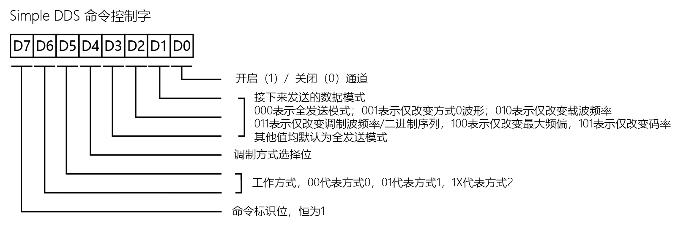

# Simple DDS

简易信号发送装置

## 工作方式

### 方式 0

简易信号发生模式

发生一个频率为 1Hz - 10MHz 波形可调的信号。

### 方式 1

模拟信号调制模式

可以选择 AM/FM 模式发生调制信号，载波频率为 1Hz - 10MHz 正弦波，调制波为 1Hz - 10MHz 正弦波，调制度 0% - 100% 可调，最大频率偏移 0Hz - 10MHz 可调。

### 方式 2

数字信号发生模式

可以选择 ASK/PSK 模式发生调制信号，载波频率为 1Hz - 10MHz 正弦波，数字信号速率为 1bps - 60kbps 可调，ASK 模式下数字信号为 0 时不发射，数字信号为 1 时发射载波；PSK 模式下数字信号为 0 时相位不变，数字信号为 1 时相位反转。传递数字信号为一字节数据，循环发送。

## 控制字

### 调制方式选择位

方式 1 下 0 代表 AM 调制，1 代表 FM 调制。

方式 2 下 0 代表 ASK 调制，1 代表 PSK 调制。

### 数据模式

发送完命令控制字后，如果开启通道，则要紧接着发送数据控制字，格式如下

#### 全发送模式

- 方式 0
  - 先发送波形频率，发送三次，由低到高发送共三个字节，拼接后得到一个 24 位无符号整数，单位为 Hz；
  - 再发送波形类型，发送一次，得到一个字节，0 代表正弦波，1 代表方波，2 代表三角波，3 代表锯齿波。

- 方式 1
  - 先发送载波频率，发送三次，由低到高发送共三个字节，拼接后得到一个 24 位无符号整数，单位为 Hz；
  - 再发送调制波频率，发送三次，由低到高发送共三个字节，拼接后得到一个 24 位无符号整数，单位为 Hz；
  - 如果是 AM 调制，还要发送调制度，发送一次，得到一个字节，0 代表 0%，100 代表 100%；
  - 如果是 FM 调制，还要发送频率偏移，发送三次，由低到高发送共三个字节，拼接后得到一个 24 位无符号整数，单位为 Hz。

- 方式 2
  - 先发送载波频率，发送三次，由低到高发送共三个字节，拼接后得到一个 24 位无符号整数，单位为 Hz；
  - 再发送数字信号速率，发送两次，由低到高发送共两个字节，拼接后得到一个 16 位无符号整数，单位为 bps；
  - 最后发送要循环发送的数字信号数据，发送一次，得到一个字节。

#### 选择发送模式

可以根据命令控制字，选择性地发送部分数据控制字，例如只发送载波频率和调制波频率，其他参数保持不变，适合频率扫描等应用场景。
